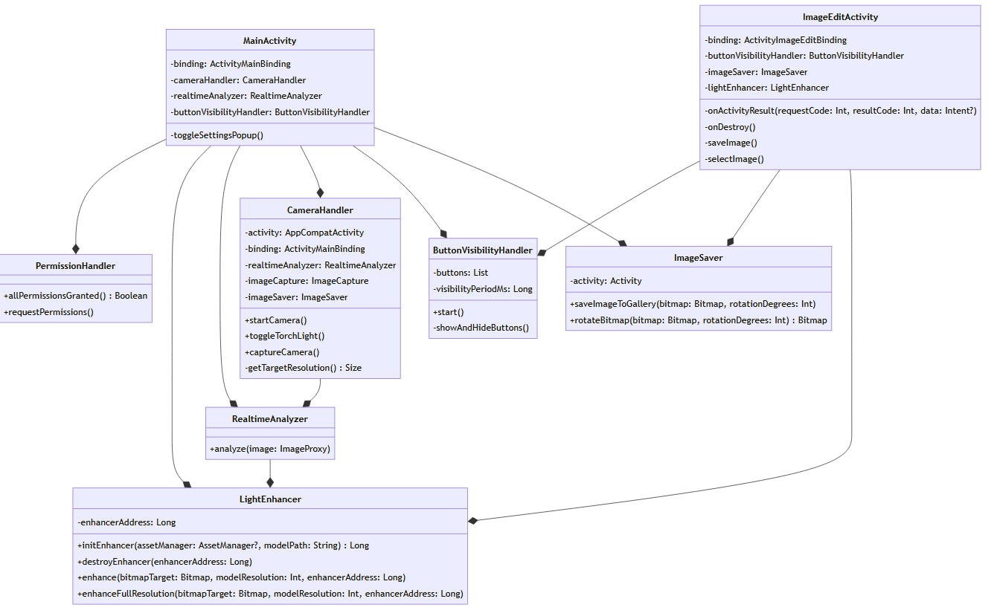

# LightEnhancer

This project includes:
- A custom light enhancement deep learning model focused on real time inference implemented using Tensorflow
- A C++ library using OpenCV and the Tensorflow C API for the model’s inference, including adapters for device specific image types and image processing strategies
- An Android app written in Kotlin which utilizes the library and allows the user to enhance and capture the back camera’s input in real-time, as well as edit existing images 

### Class diagrams

